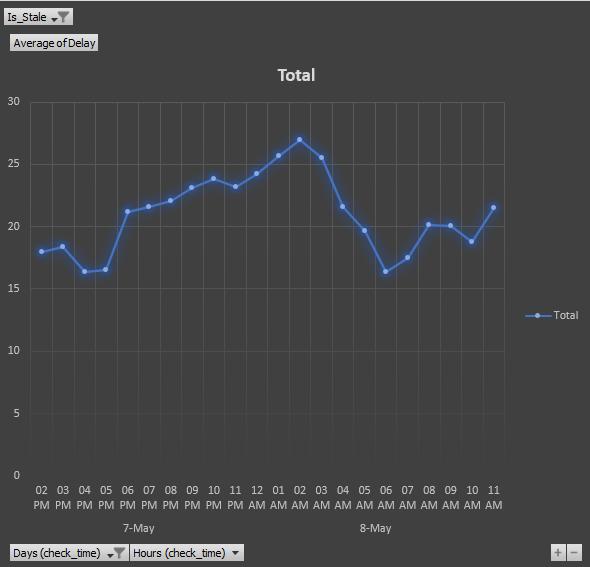

# 🚂 Hamburg Hbf Delay Tracker

### 📊 Performance Visualization

### 🛠️ How it Works
1. **Collection:** Python script fetches real-time data from the DB API.
2. **Cleaning:** Handled "Zombie" data and time-conversion math.
3. **Analysis:** Excel Pivot Tables analyze the average delay per hour.

### ⚙️ Setup
- Clone the repo.
- Add your API key to a `.env` file (not included for security).
- Run `scripts/main.py`.
