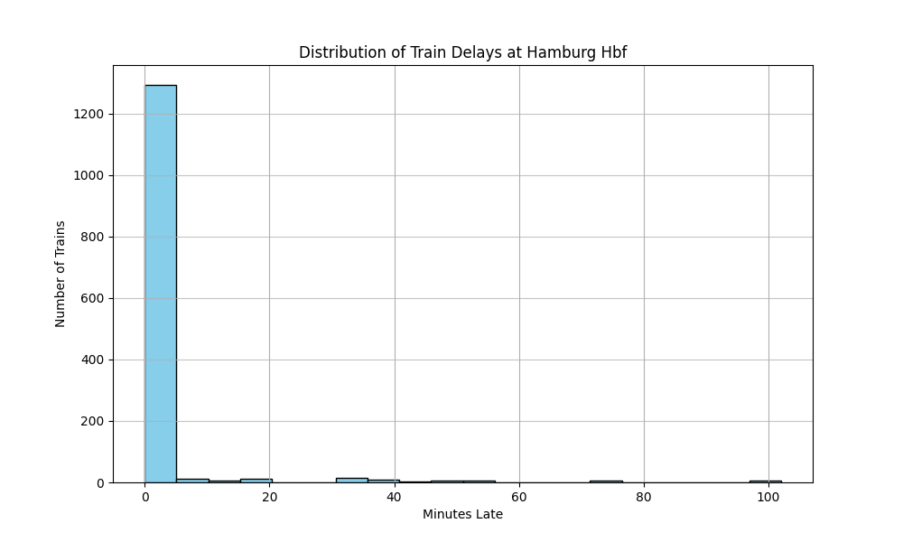
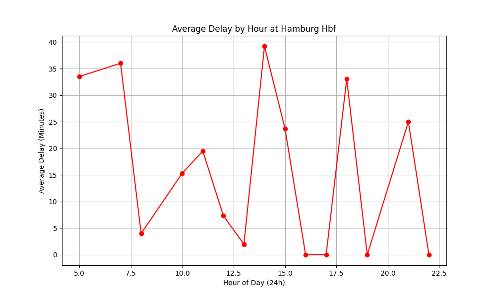

# Hamburg Hbf: Real-Time Delay Analysis 🚄

A data engineering and analysis project that monitors train punctuality at Hamburg Hauptbahnhof using the Deutsche Bahn (DB) API.

## 📊 Project Overview
This project addresses the challenge of tracking transit reliability. It uses a custom Python-based data pipeline to collect real-time arrival data, compare planned vs. actual times, and visualize the distribution of delays.

### Key Features:
- **Real-Time Collection:** Automated script fetching live XML data every 15 minutes.
- **Secure Architecture:** Professional credential management using `.env` and `.gitignore`.
- **Data Insights:** Analysis of 1,300+ arrival snapshots to identify hourly trends and outliers.

## 📈 Visualizations

### Delay Distribution
Most trains arrive within a 0-5 minute window, but significant outliers (60+ minutes) impact overall network reliability.

### Hourly Performance
This trend line helps identify "peak delay" hours during the day.

## 🛠️ Tech Stack
- **Language:** Python 3.x
- **Libraries:** Pandas (Data Wrangling), Matplotlib (Visualization), Requests (API Interaction), python-dotenv (Security)
- **Data Source:** Deutsche Bahn Timetables API

## This dataset is growing in real-time. Currently analyzing 1,300+ records with plans to conduct a full weekly trend analysis once 10,000+ records are reached."

